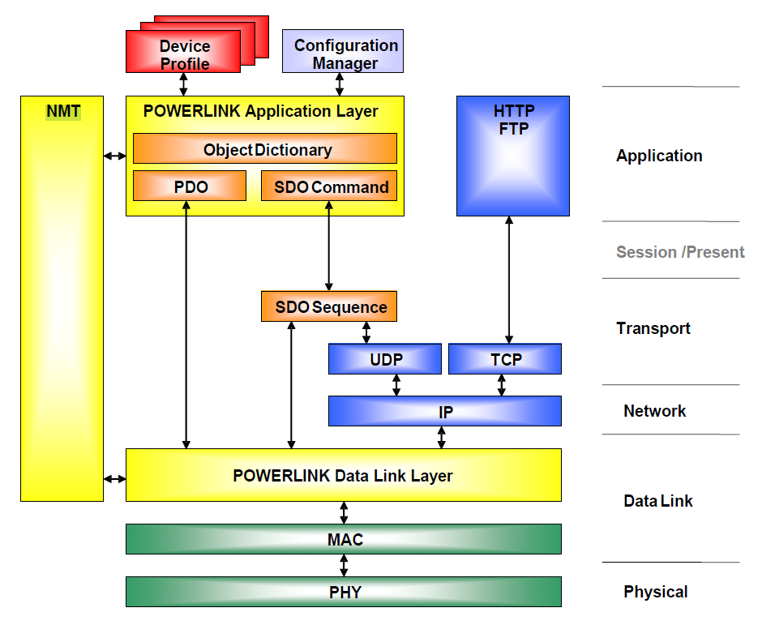
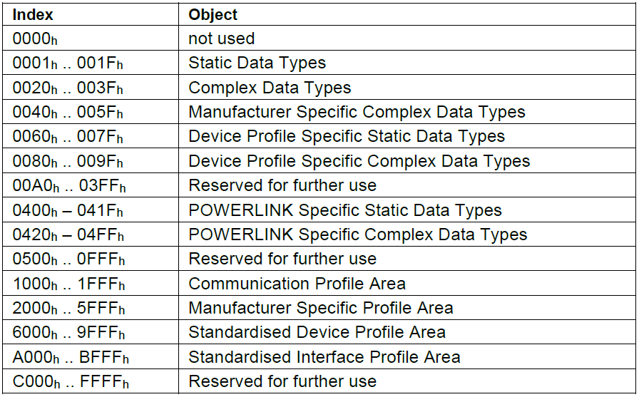
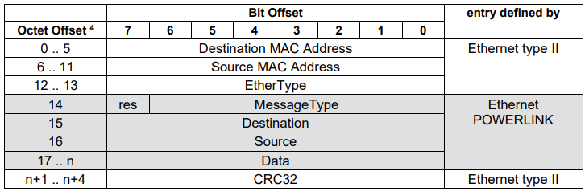

# Ethernet Powerlink Standard

The Ethernet Powerlink standard can be found at [B&R Automation downloads page](https://www.br-automation.com/en/technologies/powerlink/service-downloads/).

The specification is divided into the following files:

- **POWERLINK Communication Profile Specification**
  - EPSG 301 V-1-5-1 DS.pdf
- **Extension specifications**
  - EPSG 302-A V-1-1-1 DS.pdf
  - EPSG 302-B V-1-1-1 DS.pdf
  - EPSG 302-C V-1-1-1 DS.pdf
  - EPSG 302-D V-1-1-1 DS.pdf
  - EPSG 302-E V-1-2-1 DS.pdf
  - EPSG 302-F V-1-0-1 DS.pdf
- **XML Device Description**
  - EPSG 311 V-1-2-1 DS.pdf
  - XML Device Description – Implementation Guidelines V-1-0-2.pdf
- **Further technical specification**
  - POWERLINK_Implementation_Directive_for_CiA402_EPSG_V-0-0-4.pdf
  - EPSG_XML_header_for_firmware_files_V-1-0-0.pdf

An additional companion specification exists related to OPC-UA:

- **OPCUA POWERLINK Companion Specification**
  - OPCUA POWERLINK Companion Specification RELEASE 1.0.pdf

## Highlights

> What follows are extracts taken from the specification itself. All images found in this section come from the original specification.

POWERLINK provides mechanisms to achieve the following:

1. Transmit time-critical data in precise isochronous cycles. Data exchange is based on a publish/subscribe relationship. Isochronous data communication can be used for exchanging position data of motion applications of the automation industry.
2. Synchronise networked nodes with high accuracy.
3. Transmit less time-critical data asynchronously on request. Asynchronous data communication can be used to transfer IP-based protocols like TCP or UDP and higher layer protocols such as HTTP, FTP,…

POWERLINK manages the network traffic in a way that there are dedicated time-slots for isochronous and asynchronous data. The mechanism is called Slot Communication Network Management (SCNM). SCNM is managed by one particular networked device – the Managing Node (MN) – which includes the MN functionality. All other nodes are called Controlled Nodes (CN).

POWERLINK is based on the ISO/OSI layer model and supports Client/Server and Producer/Consumer communications relationships.

The POWERLINK communication profile is based on CANopen communication profiles DS301 and DS302.

The advantages of POWERLINK result from protecting the POWERLINK RTE network segment from regular office and factory networks. POWERLINK provides a private Class-C IP segment solution with fixed IP addresses.

**Reference model**:

### Application layer (2.1.1)

The Application Layer comprises a concept to configure and communicate real-time-data as well as the mechanisms for synchronisation between devices. The functionality the application layer offers to an application is logically divided over different service objects (see SDO) in the application layer. A service object offers a specific functionality and all related services.

Service primitives are the means by which the application and the application layer interact. There are four different primitives:

- a *request* is issued by the application to the application layer to request a service
- an *indication* is issued by the application layer to the application to report an internal event detected by the application layer or indicate that a service is requested
- a *response* is issued by the application to the application layer to respond to a previous received indication
- a *confirmation* is issued by the application layer to the application to report the result of a previously issued request.

A service type defines the primitives that are exchanged between the application layer and the co-operating applications for a particular service of a service object.

- A *Local Service* involves only the local service object. The application issues a request to its local service object that executes the requested service without communicating with (a) peer service object(s).
- An *Unconfirmed Service* involves one or more peer service objects. The application issues a request to its local service object. This request is transferred to the peer service object(s) that each pass it to their application as an indication. The result is not confirmed back.
- A *Confirmed Service* can involve only one peer service object. The application issues a request to its local service object. This request is transferred to the peer service object that passes it to the other application as an indication. The other application issues a response that is transferred to the originating service object that passes it as a confirmation to the requesting application.
- A *Provider Initiated Service* involves only the local service object. The service object (being the service provider) detects an event not solicited by a requested service. This event is then indicated to the application.

Unconfirmed and confirmed services are collectively called *Remote Services*.

### Device Model (2.2)

A device is structured as follows:

- *Communication* – This function unit provides the communication objects and the appropriate functionality to transport data items via the underlying network structure.
- *Object Dictionary* – The Object Dictionary is a collection of all the data items that have an influence on the behaviour of the application objects, the communication objects and the state machine used on this device.
- *Application* – The application comprises the functionality of the device with respect to the interaction with the process environment.

Thus the Object Dictionary serves as an interface between the communication and the application. The complete description of a device’s application with respect to the data items in the Object Dictionary is called the device profile.

### The Object Dictionary (2.2.2)

The most important part of a device profile is the Object Dictionary. The Object Dictionary is essentially a grouping of objects accessible via the network in an ordered, pre-defined fashion. Each object within the dictionary is addressed using a **16-bit index**. The Object Dictionary may contain **a maximum of 65536 entries** which are addressed through a 16-bit index.

- The Static Data Types at indices *0001h through 001Fh* contain type definitions for standard data types like BOOLEAN, INTEGER, floating point, string, etc.
- Manufacturer Specific Complex Data Types at indices 0040h through 005Fh are structures composed of standard data types but are specific to a particular device.
- Device Profiles may define additional data types specific to their device type. The static data types defined by the device profile are listed at indices 0060h - 007Fh, the complex data types at indices 0080h - 009Fh.
- A device may optionally provide the structure of the supported complex data types (indices 0020h - 005Fh and 0080h - 009Fh) at read access to the corresponding index. Sub-index 0 provides the number of entries at this index, and the following sub-indices contain the data type encoded as UNSIGNED16.
- POWERLINK Specific Static Data Types shall be described at indices 0400h – 041Fh. These entries are included for reference only; they cannot be read or written.
- POWERLINK Specific Complex Data Types shall be described at indices 0420h – 04FFh
- The Communication Profile Area at indices 1000h through 1FFFh contains the communication specific parameters for the POWERLINK network. These entries are common to all devices.
- The standardised device profile area at indices 6000h through 9FFFh contains all data objects common to a class of devices that can be read or written via the network. The device profiles may use entries from 6000h to 9FFFh to describe the device parameters and the device functionality. Within this range up to **8 different devices** can be described. In such a case the devices are denominated *Multiple Device Modules*.
  - Multiple Device Modules are composed of up to 8 device profile segments. In this way it is possible to build devices with multiple functionality. The different device profile entries are indexed at increments of 800h.
  - For Multiple Device Modules the object range 6000h to 9FFFh is sub-divided as follows:
    - 6000h to 67FFh device 0
    - 6800h to 6FFFh device 1
    - 7000h to 77FFh device 2
    - 7800h to 7FFFh device 3
    - 8000h to 87FFh device 4
    - 8800h to 8FFFh device 5
    - 9000h to 97FFh device 6
    - 9800h to 9FFFh device 7
- Space is left in the Object Dictionary at indices 2000h through 5FFFh for truly manufacturer-specific functionality.

A *16-bit index* is used to address all entries within the Object Dictionary. In the case of a simple variable the index references the value of this variable directly. In the case of records and arrays, however, the index addresses the whole data structure. To allow individual elements of structures of data to be accessed via the network *a sub-index is defined*. For single Object Dictionary entries such as an UNSIGNED8, BOOLEAN, INTEGER32 etc. the value for the sub-index is always zero. For complex Object Dictionary entries such as arrays or records with multiple data fields the sub-index references fields within a data-structure pointed to by the main index.

### Communication Model (2.3)

The communication model supports the transmission of isochronous and asynchronous frames. Isochronous frames are supported in POWERLINK Mode only, asynchronous frames in POWERLINK Mode and Basic Ethernet Mode.

The isochronous transmission of frames is supported by the POWERLINK Mode cycle structure. The system is synchronised by SoC frames. Asynchronous frames may be transmitted in the asynchronous slot of POWERLINK Mode cycle upon transmission grant by the POWERLINK MN, or at any time in Basic Ethernet Mode.

With respect to their functionality, three types of communication relationships are distinguished

- Master/Slave relationship
- Client/Server relationship
- Producer/Consumer relationship

POWERLINK collects more than one function into one frame (refer 4.6). It is therefore not usually possible to apply a single communication relationship to the complete frame, but only to particulars services inside the frame.

### Physical Layer (3)

Autonegotiation is not recommended.

To fit POWERLINK jitter requirements it is recommended to use hubs to build a POWERLINK network. Class 2 Repeaters shall be used in this case. Hubs may be integrated in the POWERLINK interface cards. Hub integration shall be indicated by **D_PHY_HubIntegrated_BOOL**. The number of externally accessible POWERLINK ports provided by a device shall be indicated by **D_PHY_ExtEPLPorts_U8**.

Switches may be used to build a POWERLINK network. The additional latency and jitter of switches has to be considered for system configuration. It has to be considered that **any POWERLINK network constructed with anything but Class 2 Repeater Devices does not conform to the POWERLINK standard as defined in this document**.

The MN uses a timeout after sending a PollRequest Frame to detect transmission errors and node failures. The round trip latency between the MN and a CN shall not exceed the timeout value. The timeout value can be set for every single node.

### Data Link Layer (4)

Two operating modes are defined for POWERLINK networks:

1. POWERLINK mode
    - In POWERLINK Mode network traffic follows the set of rules given in this standard for Real-time Ethernet communication. Network access is managed by a master, the POWERLINK Managing Node (MN). *A node can only be granted the right to send data on the network via the MN*. The central access rules preclude collisions, **the network is therefore deterministic in POWERLINK Mode**.
    - In POWERLINK Mode most communication transactions are via POWERLINK-specific messages. An asynchronous slot is available for non-POWERLINK frames. UDP/IP is the preferred data exchange mechanism in the asynchronous slot; however, it is possible to use any protocol.
2. Basic Ethernet mode
    - In Basic Ethernet Mode network communication follows the rules of Legacy Ethernet (IEEE802.3). Network access is via CSMA/CD. Collisions occur, and network traffic is nondeterministic. Any protocol on top of Ethernet may be used in Basic Ethernet mode, the preferred mechanisms for data exchange between nodes being UDP/IP and TCP/IP.

#### Powerlink Mode (4.2)

Controlled Nodes shall be only allowed to send when requested to by the MN. The Controlled Nodes shall be accessed cyclically by the MN. Unicast data shall be sent from the MN to each configured CN (frame: PReq), which shall then publish its data via multicast to all other nodes (frame: PRes).

Optionally, the MN may send a multicast Pres frame in the isochrononous phase (see Fig. 19). With this frame the MN may publish its own data to all other nodes.
All available nodes in the network shall be configured on the MN. **Only one active MN is permitted in a POWERLINK network**.

The ability of a node to perform MN functions shall be indicated by the device description entry *D_DLL_FeatureMN_BOOL*.
The ability of a node to perform CN functions shall be indicated by the device description entry *D_DLL_FeatureCN_BOOL*.

CNs may be accessed every cycle *or every nth cycle* (multiplexed nodes, n > 1).

`PReq` can only be received by the specifically addressed CN. However, **`PRes` frames shall be sent by the CN as multicast messages**, allowing all other CNs to monitor the data being sent.

The ability of a CN to perform isochronous communication shall be indicated by a feature flag in the object dictionary entry *NMT_FeatureFlags_U32* (1F82h) and the device description entry *D_NMT_Isochronous_BOOL*.

The MN shall cyclically poll each async-only CN during the asynchronous phase with a StatusRequest – a special form of the SoA frame. The CN shall respond with a StatusResponse, special form of Asynchronous Send frame. The poll interval shall be at least C_NMT_STATREQ_CYCLE.

Async-only CNs shall request the right to transmit asynchronous data from the MN, if required. Async-only CNs shall actively communicate during the asynchronous phase only. Nevertheless, they may listen to the multicast network traffic, transmitted by the MN and the isochronous CNs.

#### Services (4.2.3)

POWERLINK provides three services:

- Isochronous Data Transfer: One pair of messages per node shall be delivered every cycle, or every nth cycle in the case of multiplexed CNs. Additionally, there may be one multicast PRes message from the MN per cycle. Isochronous data transfer is typically used for the exchange of time critical data (real-time data).
- Asynchronous Data Transfer: **There may be one asynchronous message per cycle**. The right to send shall be assigned to a requesting node by the MN via the SoA message. Asynchronous data transfer is used for the exchange of non time-critical data.
- Synchronisation of all nodes: At the beginning of each isochronous phase, the MN transmits the multicast SoC message very precisely to synchronise all nodes in the network.

#### Powerlink Cycle (4.2.4)

Isochronous cycle:
[Powerlink Cycle](powerlink_cycle.png)

**All data transfers shall be unconfirmed**, i.e. there is no confirmation that sent data has been received. To maintain deterministic behavior, protecting the isochronous data (PReq and PRes) is neither necessary nor desired. Asynchronous data may be protected by higher protocol layers.

`PReq` shall be an Ethernet *unicast* frame. It is received by the target node only. `PRes` shall be sent as an Ethernet *multicast* frame.

**Both the PReq and the PRes frames may transfer application data**.

Support of PRes transmission by the MN is optional. The ability of an MN to transmit PRes shall be indicated by the device description entry *D_DLL_MNFeaturePResTx_BOOL*. If the feature is provided, transmission shall be enabled by *NMT_NodeAssignment_AU32[C_ADR_MN_DEF_NODE_ID ].Bit 12*.

The isochronous phase shall be calculated from start of SoC to start of SoA.

The order in which CNs are polled may be implementation specific or controlled by object *NMT_IsochrSlotAssign_AU8* if supported by the MN. An implementation should pack the performed PReq / PRes packages to the begin of the isochronous phase. *It should provide means to rearrange the poll order*, **to avoid location of the nodes having the worst SoC latency time value** (*D_NMT_CNSoC2PReq_U32*) at the slot following SoC.

**Multiplexed timeslots:** POWERLINK supports CN communication classes, that determine the cycles in which nodes are to be addressed.

- Continuous: Continuous data shall be exchanged in every POWERLINK cycle.
- Multiplexed: Multiplexed data to and from one CN shall not be exchanged in every POWERLINK cycle. The accesses to the multiplexed CNs shall be dispersed to the multiplexed cycle that consists of a number of POWERLINK cycles.

**The apportionment of the isochronous phase to continuous and multiplexed slots shall be fixed by configuration** (*NMT_MultiplCycleAssign_AU8*, *NMT_IsochrSlotAssign_AU8*).

In case of MN cycle loss, the multiplexed access sequence shall be continued on a per time base, after the cycle loss error phase is over. E.g. CNs shall be skipped to maintain time equidistance of access to nodes not affected by the cycle loss.

The ability of an MN enabled node to perform control of multiplexed isochronous operation shall be indicated by the device description entry *D_DLL_MNFeatureMultiplex_BOOL*. The ability of a CN enabled node to be isochronously accessed in a multiplexed way shall be indicated by the device description entry *D_DLL_CNFeatureMultiplex_BOOL*.

In the asynchronous phase of the cycle, access to the POWERLINK network may be granted to one CN or to the MN for the transfer of a single asynchronous message only. There shall be two types of asynchronous frames available:

- The POWERLINK `ASnd` frame shall use the POWERLINK addressing scheme and shall be sent via unicast or broadcast to any other node.
- A Legacy Ethernet message may be sent.

If no asynchronous message transmission request is pending at the MN scheduling queues (4.2.4.1.2.1), the MN shall issue a `SoA` without assignment of the right to send to any node. No `ASnd` frame will follow to the SoA frame in this case. The MN shall start the asynchronous phase with the SoA. The SoA shall be used to identify CNs, request status information of a CN, to poll async-only CNs and to grant the asynchronous transmit right to one CN.

The asynchronous phase shall be calculated from the start of SoA to the end of the asynchronous response. This definition is valid from the network’s point view. It may be different from the node’s application point of view. Due to the `AsyncSend` addressing scheme, the asynchronous phase may be terminated by the end of `SoA` on those nodes not being addressed, whereas it ends at the end of the asynchronous response on the addressed nodes.

Asynchronous frames may be counted by the device. If implemented, received frames shall be indicated by `DIA_NMTTelegrCount_REC.AsyncRx_U32` and transmitted frames by `DIA_NMTTelegrCount_REC.AsyncTx_U32`.

**The MN handles scheduling of all asynchronous data transfers**.

**If a CN wants to send an asynchronous frame, it shall inform the MN via the `PRes` or the `StatusResponse` frame**. *The asynchronous scheduler of the MN shall determine in which cycle the right to send the asynchronous frame will be granted*. It shall guarantee that no send request will be delayed for an indefinite amount of time, even if network load is high.

The MN shall select a node from all queued send requests (including its own). It shall send a SoA frame with a Requested Service Target identifying which node is allowed to send an asynchronous frame.

The MN shall manage the dispatching of the asynchronous phase using different queues:

- *Generic* transmit requests from the MN.
- *IdentRequest* frames from the MN to identify CNs
- *StatusRequest* frames to poll CNs
- *Transmit* requests from the CNs

*An `RS` value of 0 (000b) shall indicate that the queues are empty and an `RS` value of 7 (111b) shall indicate that 7 or more packages are queued*. **The algorithm that is used to assign the asynchronous phase when there are multiple requests pending shall be manufacturer-specific**.

##### CN Cycle State Machine (4.2.4.5)

The cycle state machine of the CN (DLL_CS) handles communication within a POWERLINK Cycle. The DLL_CS tracks the order of the frames received within a cycle and reacts as described below. The expected order of frame reception is dependant on the `NMT_CS` state (see 4.2.4.5.4 )

If an error in the communication is detected by the `DLL_CS`, an error event to DLL Error Handling will be generated. The `DLL_CS` will attempt to uphold communication regardless of any errors.

- States:
  - `DLL_CS_NON_CYCLIC`: This state means that the isochronous communication isn’t started yet or the connection was lost. It depends on the current state of the NMT_CS, which events are processed and which will be ignored.
  - `DLL_CS_WAIT_SOC`: The state machine waits in this state after receiving the SoA frame until the beginning of the next cycle (triggered by a SoC frame from the MN). Ethernet frames of any type may be received between the SoA and the SoC frames (asynchronous phase).
  - `DLL_CS_WAIT_PREQ`:  After the beginning of the cycle, the state machine waits in this state for a PReq frame. After PReq reception the CN shall respond with a PRes Frame. The CN may receive and process PRes Frames from other CN whilst in this state.
  - `DLL_CS_WAIT_SOA`: After reception of a PReq frame the state machine waits for the reception of a SoA frame. Reception of a SoA frame confirms the end of the isochronous phase. The CN may receive and process PRes Frames from other nodes whilst in this state.
- Events:
  - `DLL_CE_SOC`: This Event signifies that a POWERLINK SoC frame was received from the MN. It marks the beginning of a new cycle and simultaneously the beginning of the isochronous phase of the cycle.
  - `DLL_CE_PREQ`:  This Event signifies that a POWERLINK PReq frame was received from the MN.
  - `DLL_CE_PRES`:  The CN may be configured to process the PRes frames of other CN’s (cross traffic). Every time a PRes frame is received, a DLL_CE_PRES event is generated
  - `DLL_CE_SOA`: This event signifies that a SoA frame was received from the MN. It marks the end of the isochronous phase of the cycle and the beginning of the asynchronous phase.
  - `DLL_CE_ASND`:  This event signifies that an ASnd frame or a non POWERLINK frame has been received. Since the frame types during the asynchronous phase are not limited to POWERLINK types, this event is generated on reception of all legal Ethernet frames.
  - `DLL_CE_SOC_TIMEOUT`:  This event signifies that a SoC frame of the MN was lost. It occurs, when the SoC timeout supervision detects a missed SoC frame.

> **The state of the NMT_CS represents the network state and is used as a qualifier for certain transitions of the DLL_CS**.

##### MN Cycle State Machine (4.2.4.6)

The DLL_MS generates the flow of the frames during a POWERLINK cycle and monitors the reaction of the CNs. **The flow order is NMT_MS state dependent** (see 4.2.4.6.4 ).

Usually the CNs are synchronised by the reception of the SoC.

> **This means the most significant parameter for the synchronisation of the POWERLINK network is the timing accuracy of the event `DLL_ME_SOC_TRIG`**.

- States
  - DLL_MS_NON_CYCLIC: This state means that the cyclic communication is not started yet or was stopped by the NMT_MS state machine (NMT state NMT_MS_PRE_OPERATIONAL_1). The state machine waits here until the NMT state changes to NMT_MS_PRE_OPERATIONAL_2. It depends on the current NMT state, which events will be processed and which will be ignored.
  - DLL_MS_WAIT_SOC_TRIG: If the communication of the cycle is finished, the state machine remains in this state until the next cycle begins with a DLL_ME_SOC_TRIG.
  - DLL_MS_WAIT_PRES: After the sending of the PReq frame the state machine waits in this state for a response. The waiting time is limited by a timeout.
  - DLL_MS_WAIT_ASND:
    - If a SoA with an Invite is sent, the state machine waits in this state until the asynchronous phase ends with the event DLL_ME_SOC_TRIG.
    - In DLL_MS_NON_CYCLIC the event DLL_ME_SOA_TRIG shall be generated instead of DLL_ME_SOC_TRIG.
    - If a ASnd is expected and the timeout NMT_MNCycleTiming_REC.AsyncSlotTimeout_U32 occurs, the error DLL_MEV_SOA_TIMEOUT shall be generated.
  - DLL_MS_WAIT_SOA:  If a SoA with an Invite is sent that is not to be answered, the MN waits in this state until the timeout of the async phase elapsed or any Ethernet frame was received before the next reduced POWERLINK cycle starts.
- Events:
  - Notes:
    - The DLL_MS is triggered by events which are generated by an event handler. The DLL_MS has an interface to:
      - the hardware.
      - the NMT state machine.
    - The event handler should serialize the events (it’s possible that a timeout occurs simultaneously with an Ethernet frame receiving). The implementation of the interface to the hardware is out of the scope of this specification.
  - DLL_ME_PRES: This event signifies that a PRes frame was received.
  - DLL_ME_PRES_TIMEOUT: This event is produced when the PRes frame was not (or not completely) received within a preconfigured time.
  - DLL_ME_ASND: This event means that an ASnd frame or an non POWERLINK frame was received.
  - DLL_ME_ASND_TIMEOUT: This event is produced when the ASnd frame was not (or not completely) received within a preconfigured time.
  - DLL_ME_SOC_TRIG: This event triggers emission of the SoC frame and starts a new POWERLINK cycle. The timing accuracy determines the synchronisation accuracy of the POWERLINK network.
  - DLL_ME_SOA_TRIG: This event means that a new reduced POWERLINK cycle shall start. The event can either be generated cyclically or directly after the reception of a requested ASnd message to continue the reduced POWERLINK cycle as fast as possible.

> **The state of the NMT_MS represents the network state and is used as a condition in some transitions of the DLL_MS.**.

#### Recognizing Active Nodes (4.2.5)

The MN shall be configured with a list of all nodes on the network.

All configured nodes shall be marked as inactive when the MN boots. Configured but inactive CNs shall be periodically accessed by an IdentRequest, a special form of the SoA frame. When a CN receives an IdentRequest addressed to itself, it shall return an IdentResponse, a special form of an ASnd frame, in the same asynchronous phase.

The CN shall be marked as active if the MN receives an IdentResponse from the CN. An active CN may take part in the isochronous data transfer, e.g. it may be accessed via a PReq.

#### Basic Ethernet Mode (4.3)

Network communication behaves according to the rules of the Legacy Ethernet (IEEE 802.3). The network medium is accessed according to CSMA/CD. The network communication is collision-prone and non-deterministic. In the Basic Ethernet Mode any protocol on top of Legacy Ethernet can be used. Data between the nodes are preferentially exchanged via UDP/IP and TCP/IP.

> **POWERLINK nodes shouldn’t operate in Basic Ethernet Mode**, *when the node is part of a automation system*. *Basic Ethernet Mode is provided for point to point configurations, to be used for node setup and service purpose only*.

#### MAC Addressing (4.4)

A POWERLINK node must support unicast, multicast and broadcast Ethernet MAC addressing in accordance with IEEE802.3. The high-order bit of the MAC address is 0 for ordinary addresses (unicast) and it shall be unique. For group addresses the high-order bit of the MAC address is 1. The address consisting of all 1 bits is reserved for broadcast. The following MAC-multicast addresses shall be used:

|                                                             | MAC Multicast Address |
| ----------------------------------------------------------- | --------------------- |
| Start of Cycle (SoC)                                        | C_DLL_MULTICAST_SOC   |
| PollResponse (PRes)                                         | C_DLL_MULTICAST_PRES  |
| Start of Asynchronous (SoA)                                 | C_DLL_MULTICAST_SOA   |
| AsynchronousSend (ASnd)                                     | C_DLL_MULTICAST_ASND  |
| Active Managing Node Indication (AMNI) used by EPSG DS302-A | C_DLL_MULTICAST_AMNI  |

#### POWERLINK Addressing

Each POWERLINK node (MN, CN and Router) has a unique Node ID within a POWERLINK segment.

> **The number 240 is permanently assigned to the MN**. POWERLINK Node IDs 1-239 may used for the CNs.

POWERLINK node IDs:

| Number      | Constant               | Description                                           | Access Options                                 |
| ----------- | ---------------------- | ----------------------------------------------------- | ---------------------------------------------- |
| 0           | C_ADR_INVALID          | Invalid                                               | No                                             |
| 1 ... 239   |                        | Regular POWERLINK CNs                                 | No / mandatory / optional / isoch / async only |
| 240         | C_ADR_MN_DEF_NODE_ID   | POWERLINK MN                                          | mandatory isoch                                |
| 241 ... 250 |                        | Reserved (used by EPSG DS302-A)                       | no                                             |
| 251         | C_ADR_SELF_ADR_NODE_ID | Pseudo node ID to be used by a node to address itself | no                                             |
| 252         | C_ADR_DUMMY_NODE_ID    | Dummy node                                            | no                                             |
| 253         | C_ADR_DIAG_DEF_NODE_ID | Diagnostic device                                     | optional / isoch / async only                  |
| 254         | C_ADR_RT1_DEF_NODE_ID  | POWERLINK to legacy ethernet router                   | no / mandatory / optional / isoch              |
| 255         | C_ADR_BROADCAST        | broadcast                                             | no                                             |

#### Frame Structures (4.6)

POWERLINK is a protocol residing on top of the standard 802.3 MAC layer. POWERLINK messages shall be encapsulated in Ethernet II frames.

> *The Ethernet Type (Ethertype) field shall be set to 88ABh (C_DLL_ETHERTYPE_EPL)*.

The length of the frame shall be restricted to the configured size. Otherwise the cycle time could not be guaranteed. Ethernet frames shall not be shorter than the specified minimum of 64 octets.

POWERLINK Basic Frame:

The POWERLINK Basic Frame format shall contain 5 fields:

- Reserved (1 bit)
- MessageType (7 bits)
- Destination node address (1 octet), POWERLINK addressing scheme (See 4.5)
- Source node address (1 octet), POWERLINK addressing scheme (See 4.5)
- Payload (n octets)

The POWERLINK Basic Frame format shall be encapsulated by the Ethernet II wrapper consisting of 14 octets of leading Ethernet header (Destination and Source MAC addresses, EtherType) and 4 octets of terminating CRC32 checksum.

| Field | Abbr. | Description | Value |
| - | - | - | - |
| Destination MAC addr. | dmac | MAC Address of the addressed node.          | see 4.4             |
| Source MAC addr.      | smac | MAC address of the transmitting node.       | see 4.4             |
| EtherType             | etyp | Ethernet message type.                      | C_DLL_ETHERTYPE_EPL |
| MessageType           | mtyp | POWERLINK message type identification.      | see table below     |
| Destination           | dest | POWERLINK Node ID of the addressed node.    | see 4.5             |
| Source                | src  | POWERLINK Node ID of the transmitting node. | see 4.5             |
| Data                  | data | Data depending on the message type.         | refer below         |
| CRC 32                | crc  | CRC32 checksum                              |                     |
